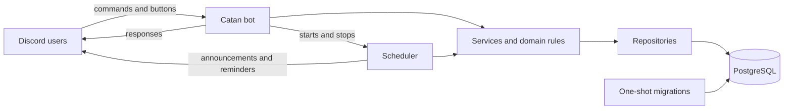

# Catan Tracker

A Discord bot for that tracks Catan wins and losses and ranks players by win rate. Seasons run for a set period with a minimum-games threshold (default 2) for eligibility; when a season ends, the lowest-ranked eligible player buys food for the top-ranked player. The bot also schedules game nights with RSVPs and reminders.

## Features

- Multi-server season tracking with configurable end dates and eligibility
- Confirmed game reports, voiding, history, leaderboards, and player stats
- Rules-aware game reports for Normal, Seafarers, Cities & Knights, and combined games
  with optional 5–6 Player Extension, scenario, target score, local played time, and point breakdowns
- Per-player score collection over DM: reporting a game creates it immediately and DMs each
  participant their own one-page sheet, with the public message doubling as a live, progressively
  filled-in score sheet. Anyone who hasn't submitted is automatically re-prompted roughly once a
  day, up to three times, alongside a channel notice naming who's still missing, then it goes quiet
- Recurring leaderboard posts (off, after every confirmed game, or a daily digest), configurable
  per server
- Game-night events with grouped RSVP buttons, optional role-only pings, and targeted reminders
- Automatic season resolution with frozen result announcements
- Least-privilege PostgreSQL roles, bounded output, and mention-safe responses

## Architecture



## Commands

| Command | Description | Who | Status |
|---|---|---|---|
| `/help` | List available commands | Anyone | Available |
| `/config channel` / `timezone` / `admin-role` / `player-role` / `leaderboard` / `show` | View or change the server configuration. `player-role` is the optional role pinged for new events and reminders. `leaderboard` configures the recurring leaderboard post; every option but `mode` is optional and, if omitted, leaves its current value untouched. | Manage Server | Available |
| `/game report` | Report a game's winner/losers, ruleset, and optional extension/scenario/target/time. The game is created immediately; each participant is then DM'd their own one-page score-entry sheet. | Anyone | Available |
| `/game scores [game_id]` | Reopen your own score-entry sheet -- the fallback if a DM never arrived (closed DMs) or was closed. Defaults to your most recent game still awaiting your score. | The sheet's own player | Available |
| Confirm / Reject / Nudge buttons | On a reported game's public message: confirm or reject the report, or nudge whichever participants still owe a score (rate-limited per game). Confirming while someone's score is still missing shows an ephemeral "confirm anyway" second step naming who hasn't submitted. | Other participants (reporter may retract); nudge: any participant or the reporter | Available |
| `/game void`, `/game history`, `/game show` | Void a game / view chronological, numbered history (voided games hidden unless `include_voided` is set) / show one game's full details | Admin / anyone | Available |
| `/game update` | Admin-only correction of a confirmed game, with optional field preservation and audit revisions | Admin | Available |
| `/leaderboard [channel]`, `/stats` | View rankings and player stats. A selected leaderboard channel receives the public board; otherwise it posts here. | Anyone | Available |
| `/event create [date] [channel] ...`, `/event list`, `/event cancel` | Schedule and manage game nights. A selected channel receives the event; otherwise it posts here. | Anyone / creator or admin | Available |
| RSVP buttons | Going / Maybe / Not going | Anyone | Available |

### Reporting a game and collecting scores

`/game report` no longer shows the reporter a score sheet to fill in on the
spot. It validates the winner/losers and ruleset, creates the game right
away, and posts a public message with Confirm/Reject/Nudge buttons that
doubles as the live score sheet: a receipt checkmark (✅) appears next to
each participant as their row arrives, a closed-DM participant is marked
distinctly (🚫) and can use `/game scores` instead, and everyone else shows
pending (⏳). Each participant is separately DM'd their own one-page sheet
to fill in only their own row -- partial scoring while people catch up is
normal and expected, not an error state.

Anyone who still hasn't submitted a score is chased automatically: the scheduler
re-prompts them roughly once a day (up to three times total) with a fresh copy of
their DM sheet, and posts one notice in the game's channel naming everyone still
missing for that round -- visible even to someone who has muted or closed their
DMs, since a blocked DM is recorded but never stops the rest of that game's
players from being chased. After three rounds with no response, the re-prompts
stop and the game simply keeps whatever scores were entered; a participant can
still fill theirs in at any time with `/game scores`.

Because scores can still be trickling in, pressing Confirm behaves
differently depending on how complete the roster is. Once every
participant's row is in, Confirm works immediately, exactly as before --
no extra click. If any row is still missing, Confirm instead shows an
ephemeral "confirm anyway" second step, visible only to whoever clicked,
naming exactly who hasn't submitted yet and offering **Confirm anyway** /
**Cancel**. Cancel leaves the game pending with nothing changed; Confirm
anyway runs the same confirmation as the direct path (including the
existing rule that the reporter can't confirm their own game), just with a
deliberate extra step before a game is saved with partial scores.

The score sheet changes with the selected ruleset. It includes the applicable
ways to score, such as settlements (houses), cities, Longest Road or Longest
Trade Route, Largest Army, victory-point cards, Cities & Knights progress-card
awards, metropolis bonuses, and scenario points. Reports display players as
compact `P1`–`P6` columns with a mention legend so long Discord names do not
make the table unwieldy.

Leaving a player's row untouched records their points as **unrecorded**
(database `NULL`) and displays `Points not recorded`; it is not treated as a
zero. Entering `0` records an explicit zero. Once any field in a row is
entered, that whole row must be completed. The report also shows its
humanized game type, 5–6 Player Extension, scenario and target when
applicable, and the local played date/time (12-hour clock, e.g. `7:30 PM`)
with the configured timezone. Older reports without a time show
`Time not recorded`.

Game history is indexed newest-first by played date, then played local time
when available, with the game id as a stable tie-breaker for games sharing a
date and time; each row is numbered in that order, and voided games are
excluded unless `/game history`'s `include_voided` option is set.

### Recurring leaderboard posts

`/config leaderboard` turns on an automatic leaderboard post: `off` (the
default), `per-game` (right after every confirmed game), or `daily` (a
digest once a day at a configured local time, default 10:00 PM). `scope`
picks season or all-time standings, and `channel` picks where it posts,
falling back to the announcement channel the first time a leaderboard
channel is configured. Every option except `mode` is optional; an omitted
one leaves its current value exactly as it was, rather than resetting it --
running `/config leaderboard mode:daily` on its own only changes the mode,
it does not touch an already-configured channel, scope, or time. Use
`clear_channel:true` to explicitly clear a configured leaderboard channel
(only valid together with `mode:off`, since every other mode needs
somewhere to post). A daily post also shows movement arrows (🔼/🔽/🆕) versus
the previous post's standings.

### Correcting confirmed games

Use `/game update` for an admin-only correction instead of voiding and
re-reporting a confirmed game. Omitted optional fields preserve their current
values. Supplying any loser replaces the entire loser roster, while supplying
only a winner swaps the winner within the existing roster. Use `clear_time` or
`clear_scenario` when an optional value should be removed. Updates apply only
to confirmed games; changing the winner or roster is blocked when the game
belongs to a completed season. Every successful edit increments an audit
revision and records the editor and optional reason. There is no separate
audit-history command: `/game show` is the current source of truth.

Scores follow the same NULL distinction during updates: a blank/unrecorded
score remains database `NULL`, while an entered `0` is an explicit zero.

## Tech stack

- Python 3.12
- [discord.py](https://discordpy.readthedocs.io/)
- asyncpg
- PostgreSQL 16
- Docker Compose
- pytest, ruff, bandit
- Oracle Cloud (OCI)

## Security: SQL injection prevention

- All queries use parameterized placeholders (`$1`, `$2`, ...); SQL text is kept as fixed string constants and is never built from user input.
- An AST-based static guard test fails the test suite when it detects dynamically built SQL or database calls outside the data-access layer.
- The database uses least-privilege roles: the application's runtime role cannot `DELETE`, `DROP`, `TRUNCATE`, or `ALTER` anything — only `SELECT`/`INSERT`/`UPDATE` on existing tables. Schema changes require a separate migration role.
- A server-side `statement_timeout` applied to every pooled connection, plus a client-side command timeout, bound query run time.
- The database port is bound to `localhost` only; it is never exposed publicly.
- Discord mentions are disabled by default (`AllowedMentions.none()`); event announcements and reminders can allow only the configured player role. An unset player role sends no ping.

See the [security guide](docs/SECURITY.md) for the threat model, operational
controls, incident response, and disclosure process.

## Getting started (local)

Prerequisites: Docker, Python 3.12.

1. Create a Discord application and bot at the [Discord Developer Portal](https://discord.com/developers/applications). No privileged intents are required. When generating an invite link, use scopes `bot` + `applications.commands` with permissions View Channel, Send Messages, and Embed Links.
2. Copy the environment template, then fill it in (use the command below to generate strong passwords for the database variables):

   ```bash
   cp .env.example .env
   openssl rand -hex 24
   ```

3. Start the database, run migrations, then start the bot:

   ```bash
   docker compose up -d db
   docker compose run --rm migrate
   docker compose up -d bot
   ```

The migration service applies all pending migrations, including `0004` for
confirmed-game updates and audit revisions. Do not skip the migration service
when deploying this release.

To publish slash commands after installing or updating the bot, set
`SYNC_COMMANDS=true` for one startup. Set `DEV_GUILD_ID` as well to sync to a
development server immediately; a global sync can take up to an hour to
propagate. After the successful sync, set `SYNC_COMMANDS=false` again for
normal restarts.

## Running tests

```bash
python3.12 -m venv .venv
.venv/bin/pip install -e ".[dev]"

.venv/bin/ruff check .
.venv/bin/bandit -r src
.venv/bin/pytest
```

Integration tests run against a real Postgres database and are skipped automatically unless `TEST_DATABASE_URL` and `TEST_MIGRATOR_DATABASE_URL` are set, pointing at a `catan_test` database.

## Project structure

```
catan-tracker/
├── .github/workflows/ci.yml # lint, static checks, and test jobs
├── docs/                    # deployment and security guides
├── src/catan_bot/
│   ├── __main__.py     # entry point: python -m catan_bot
│   ├── bot.py          # CatanBot: pool + cog loading + command sync
│   ├── config.py       # settings (BotSettings, MigrateSettings)
│   ├── cogs/           # config, season, game, stats, event, and help commands
│   ├── db/
│   │   ├── pool.py         # asyncpg pool factory
│   │   ├── migrate.py      # versioned migration runner
│   │   ├── migrations/     # SQL migration files
│   │   └── repositories/   # all application SQL lives here
│   ├── domain/         # pure dates, validation, ranking, bet, and reminder logic
│   ├── scheduler.py    # season resolution, announcements, and event reminders
│   ├── services/       # transactions and application workflows
│   └── views/          # persistent game confirmation and event RSVP buttons
├── db/roles.sql, db/init/   # least-privilege role setup
├── tests/static/            # AST-based SQL injection guard
├── tests/integration/       # tests against a real Postgres instance
├── docker-compose.yml
├── Dockerfile
└── pyproject.toml
```

## Deployment

The bot is designed to run 24/7 on a small always-on machine, such as an Oracle
Cloud Always Free ARM VM. Follow the [deployment guide](docs/DEPLOYMENT.md) for
Discord setup, host hardening, Docker installation, command sync, updates,
backups, and restore-rehearsal procedures.
