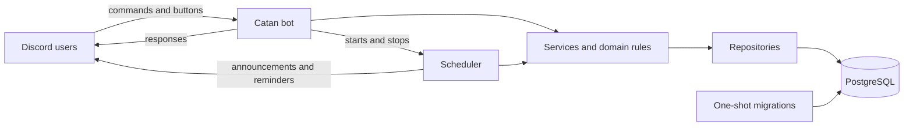

# Catan Tracker

A Discord bot for a friend group that tracks Catan wins and losses and ranks players by win rate. Seasons run for a set period with a minimum-games threshold (default 2) for eligibility; when a season ends, the lowest-ranked eligible player buys food for the top-ranked player. The bot also schedules game nights with RSVPs and reminders.

## Features

- Multi-server season tracking with configurable end dates and eligibility
- Confirmed game reports, voiding, history, leaderboards, and player stats
- Game-night events with grouped RSVP buttons, optional role-only pings, and targeted reminders
- Automatic season resolution with frozen result announcements
- Least-privilege PostgreSQL roles, bounded output, and mention-safe responses

## Architecture



## Commands

| Command | Description | Who | Status |
|---|---|---|---|
| `/help` | List available commands | Anyone | Available |
| `/config channel` / `timezone` / `admin-role` / `player-role` / `show` | View or change the server configuration. `player-role` is the optional role pinged for new events and reminders. | Manage Server | Available |
| `/season start` / `min-games` / `end-date` / `end` / `cancel` / `info` / `history` | Manage seasons and the win/loss eligibility threshold (default 2) | Admin (`info`/`history`: anyone) | Available |
| `/game report winner loser1 [...] [date]` | Report a game; `date` defaults to today | Anyone | Available |
| Confirm / Reject buttons | Confirm or reject a pending report | Other participants; reporter may retract | Available |
| `/game void`, `/game history` | Void a game / view game history | Admin / anyone | Available |
| `/leaderboard [channel]`, `/stats` | View rankings and player stats. A selected leaderboard channel receives the public board; otherwise it posts here. | Anyone | Available |
| `/event create [date] [channel] ...`, `/event list`, `/event cancel` | Schedule and manage game nights. A selected channel receives the event; otherwise it posts here. | Anyone / creator or admin | Available |
| RSVP buttons | Going / Maybe / Not going | Anyone | Available |

## Tech stack

- Python 3.12
- [discord.py](https://discordpy.readthedocs.io/)
- asyncpg
- PostgreSQL 16
- Docker Compose
- pytest, ruff, bandit
- Oracle Cloud (OCI)

## Security: SQL injection prevention

- All queries use parameterized placeholders (`$1`, `$2`, ...); SQL text is kept as fixed string constants and is never built from user input.
- An AST-based static guard test fails the test suite when it detects dynamically built SQL or database calls outside the data-access layer.
- The database uses least-privilege roles: the application's runtime role cannot `DELETE`, `DROP`, `TRUNCATE`, or `ALTER` anything — only `SELECT`/`INSERT`/`UPDATE` on existing tables. Schema changes require a separate migration role.
- A server-side `statement_timeout` applied to every pooled connection, plus a client-side command timeout, bound query run time.
- The database port is bound to `localhost` only; it is never exposed publicly.
- Discord mentions are disabled by default (`AllowedMentions.none()`); event announcements and reminders can allow only the configured player role. An unset player role sends no ping.

See the [security guide](docs/SECURITY.md) for the threat model, operational
controls, incident response, and disclosure process.

## Getting started (local)

Prerequisites: Docker, Python 3.12.

1. Create a Discord application and bot at the [Discord Developer Portal](https://discord.com/developers/applications). No privileged intents are required. When generating an invite link, use scopes `bot` + `applications.commands` with permissions View Channel, Send Messages, and Embed Links.
2. Copy the environment template, then fill it in (use the command below to generate strong passwords for the database variables):

   ```bash
   cp .env.example .env
   openssl rand -hex 24
   ```

3. Start the database, run migrations, then start the bot:

   ```bash
   docker compose up -d db
   docker compose run --rm migrate
   docker compose up -d bot
   ```

To publish slash commands after installing or updating the bot, set
`SYNC_COMMANDS=true` for one startup. Set `DEV_GUILD_ID` as well to sync to a
development server immediately; a global sync can take up to an hour to
propagate. After the successful sync, set `SYNC_COMMANDS=false` again for
normal restarts.

## Running tests

```bash
python3.12 -m venv .venv
.venv/bin/pip install -e ".[dev]"

.venv/bin/ruff check .
.venv/bin/bandit -r src
.venv/bin/pytest
```

Integration tests run against a real Postgres database and are skipped automatically unless `TEST_DATABASE_URL` and `TEST_MIGRATOR_DATABASE_URL` are set, pointing at a `catan_test` database.

## Project structure

```
catan-tracker/
├── .github/workflows/ci.yml # lint, static checks, and test jobs
├── docs/                    # deployment and security guides
├── src/catan_bot/
│   ├── __main__.py     # entry point: python -m catan_bot
│   ├── bot.py          # CatanBot: pool + cog loading + command sync
│   ├── config.py       # settings (BotSettings, MigrateSettings)
│   ├── cogs/           # config, season, game, stats, event, and help commands
│   ├── db/
│   │   ├── pool.py         # asyncpg pool factory
│   │   ├── migrate.py      # versioned migration runner
│   │   ├── migrations/     # SQL migration files
│   │   └── repositories/   # all application SQL lives here
│   ├── domain/         # pure dates, validation, ranking, bet, and reminder logic
│   ├── scheduler.py    # season resolution, announcements, and event reminders
│   ├── services/       # transactions and application workflows
│   └── views/          # persistent game confirmation and event RSVP buttons
├── db/roles.sql, db/init/   # least-privilege role setup
├── tests/static/            # AST-based SQL injection guard
├── tests/integration/       # tests against a real Postgres instance
├── docker-compose.yml
├── Dockerfile
└── pyproject.toml
```

## Deployment

The bot is designed to run 24/7 on a small always-on machine, such as an Oracle
Cloud Always Free ARM VM. Follow the [deployment guide](docs/DEPLOYMENT.md) for
Discord setup, host hardening, Docker installation, command sync, updates,
backups, and restore-rehearsal procedures.
